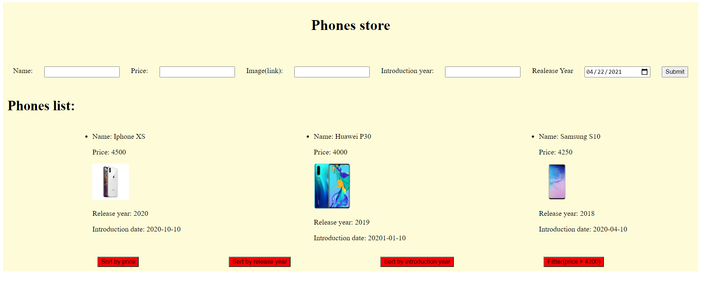

# Phones-store-page

It is the main page of an phones store. By default this page is loaded with a list of 3 phones model. You can actualise the list helping by submit button which will add a new phone in the list.

In the "Image" input you need to add the link image to add the new phone with the image that you want oterwise the new phone added will have an image by default.

Also at the button of the page are 4 buttons which will help the customer to sort the phones list by: price, release year, introduction year and by predefined price (greather than 4200).

